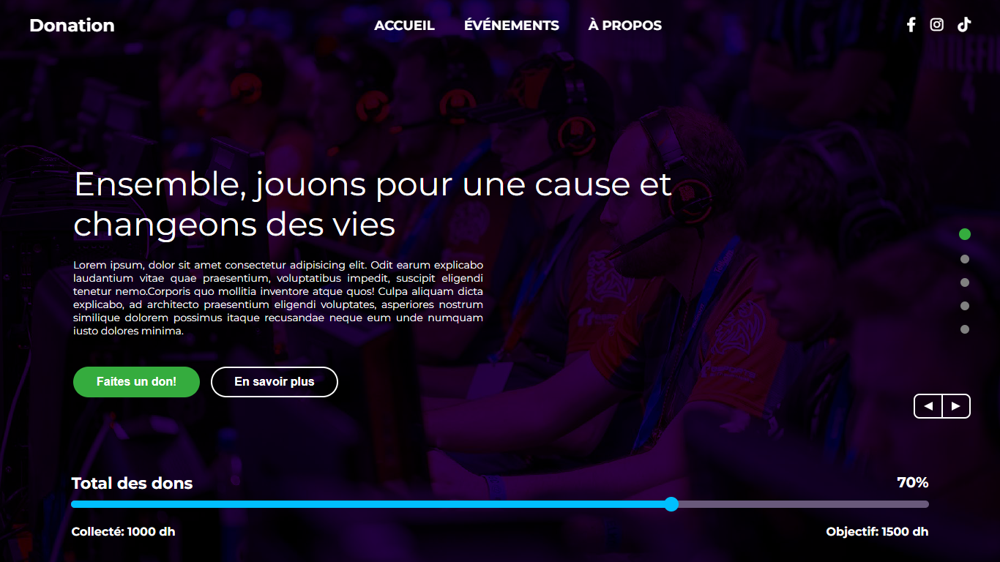
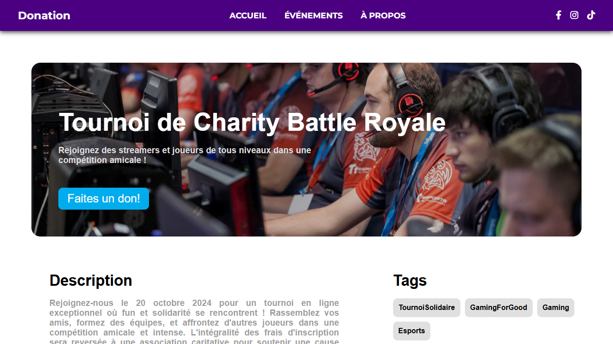
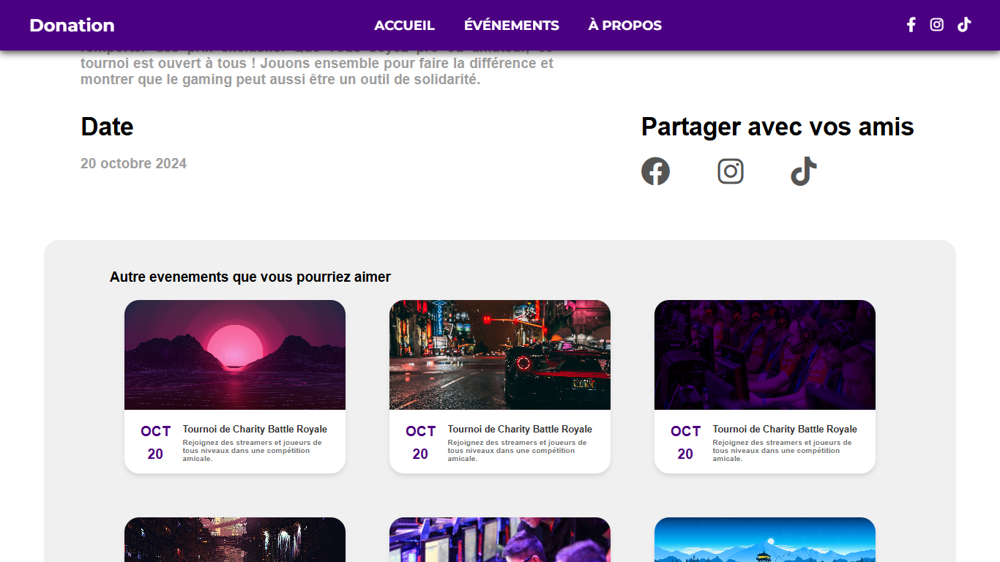

# Do-Nation - Charity Donation Platform

A modern, responsive web application for charity events and donations. This frontend-only application provides an intuitive interface for users to discover charity events, learn about causes, and make donations.



## 🎯 Purpose

Do-Nation is designed to bridge the gap between charitable organizations and donors by providing a user-friendly platform where:
- Users can discover upcoming charity events
- Learn about different causes and their impact
- Make donations to support various initiatives
- Stay informed about event details and progress

## 🚀 Features

### Core Functionality
- **Home Page**: Landing page with hero section showcasing main events
- **Events Page**: Browse and filter through various charity events
- **Event Details**: Detailed information about specific events
- **About Page**: Information about the platform and mission
- **Responsive Design**: Optimized for desktop, tablet, and mobile devices

### User Experience
- **Interactive Navigation**: Smooth scrolling and intuitive navigation
- **Progress Tracking**: Visual progress bars for donation goals
- **Event Filtering**: Categorize events by type and interest
- **Modern UI**: Clean, professional design with engaging visuals

## 🛠️ Technologies Used

### Frontend Framework
- **React 18.3.1** - Modern JavaScript library for building user interfaces
- **React Router DOM 6.27.0** - Client-side routing for single-page applications
- **React Scroll 1.9.0** - Smooth scrolling functionality

### Build Tools
- **Vite 5.4.8** - Fast build tool and development server
- **ESLint** - Code linting and quality assurance

### Development Tools
- **@vitejs/plugin-react** - React support for Vite
- **ESLint plugins** - React-specific linting rules

## 📱 Screenshots

### Home Page

*Main landing page featuring the hero section with donation progress and call-to-action buttons*

### Event Details Page 1

*Detailed view of a charity event with comprehensive information and donation options*

### Event Details Page 2

*Additional event information including related events and detailed descriptions*

## 🏃‍♂️ Getting Started

### Prerequisites
- Node.js (version 14 or higher)
- npm (comes with Node.js)

### Installation

1. **Clone the repository**
   ```bash
   git clone https://github.com/YassineFaidi/Do-Nation.git
   cd Do-Nation
   ```

2. **Install dependencies**
   ```bash
   npm install
   ```

3. **Start the development server**
   ```bash
   npm run dev
   ```

4. **Open your browser**
   Navigate to `http://localhost:1234` (or the URL shown in your terminal)

### Available Scripts

- `npm run dev` - Start development server
- `npm run build` - Build for production
- `npm run preview` - Preview production build
- `npm run lint` - Run ESLint for code quality

## 📁 Project Structure

```
Do-Nation/
├── src/
│   ├── Components/
│   │   ├── Pages/          # Main page components
│   │   │   ├── HeroSection.jsx # Landing hero section
│   │   │   ├── Cards.jsx       # Event cards component
│   │   │   ├── Navbar.jsx      # Navigation component
│   │   │   └── Footer.jsx      # Footer component
│   │   ├── assets/             # Images and static assets
│   │   ├── constants.jsx       # Static data and constants
│   │   ├── App.jsx            # Main application component
│   │   └── main.jsx           # Application entry point
│   ├── screenshots/            # Application screenshots
│   ├── package.json           # Dependencies and scripts
│   └── vite.config.js         # Vite configuration
```

## 🎨 Key Components

### HeroSection
- Displays main event information
- Shows donation progress
- Contains call-to-action buttons

### Cards
- Grid layout of event cards
- Quick overview of available events
- Links to detailed event pages

### Navigation
- Responsive navigation bar
- Mobile-friendly hamburger menu
- Active page highlighting

## 🌐 Browser Support

- Chrome (latest)
- Firefox (latest)
- Safari (latest)
- Edge (latest)

## 📝 License

This project is open source and available under the [MIT License](LICENSE).

## 🤝 Contributing

1. Fork the repository
2. Create a feature branch (`git checkout -b feature/AmazingFeature`)
3. Commit your changes (`git commit -m 'Add some AmazingFeature'`)
4. Push to the branch (`git push origin feature/AmazingFeature`)
5. Open a Pull Request

## 📞 Support

For support and questions, please open an issue in the repository or contact the development team.

---

**Built with ❤️ for making the world a better place through technology**
